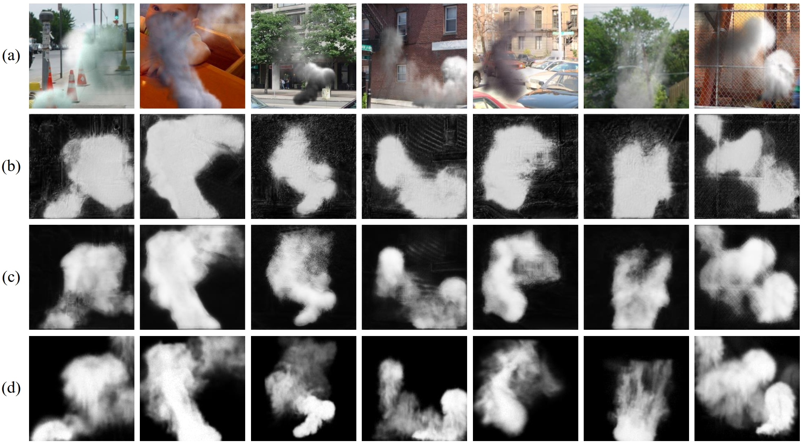

# Refining the Granularity of Smoke Representation: SAM-Powered Density-Aware Progressive Smoke Segmentation Framework


This repository contains the official PyTorch implementation of **DenSiSeg**, a novel smoke segmentation framework that explicitly models smoke density variations via a progressive optimization scheme and background-guided representation learning.

---

## 🔥 Highlights

- 🌀 **Density-aware prediction** using a novel cosine-based estimation module.
- 🧠 **Background-guided learning** with SAM-derived feature alignment.
- 📈 **Soft contrastive learning** to improve intra-class separability.

---

## 📦 Installation

```bash
# Clone the repo
git clone https://github.com/yourusername/DenSiSeg.git
cd DenSiSeg

# Create environment (optional but recommended)
conda create -n densiseg python=3.8
conda activate densiseg

# Install dependencies
pip install -r requirements.txt

```

## 🎯 Qualitative Results

Below is a representative visualization of **DenSiSeg** on challenging smoke scenes:

<p align="center">
  
</p>

*Results on SYN70K dataset. (a) Inputs. (b) Segmentation results of baseline model. (c) Output of our DenSiSeg. (d) Ground truth of smoke density.*

## 📖 Citation

If you find **DenSiSeg** useful for your research, please consider citing our paper:

```bibtex
@article{cao2025densiseg,
  title     = {Refining the Granularity of Smoke Representation: SAM-Powered Density-Aware Progressive Smoke Segmentation Framework},
  author    = {Yichao Cao, Feng Yang, Xuanpeng Li, Xiaolin Meng, and Xiaobo Lu},
  year      = {2025}
}

## 🙏 Acknowledgements

We sincerely thank the authors of the following datasets for their valuable contributions to smoke segmentation research:

- **[SYN70K](http://staff.ustc.edu.cn/~yfn/dss.html)**: A large-scale synthetic smoke dataset that enables effective training and evaluation of smoke density estimation models.
- **[SMOKE5K](https://github.com/SiyuanYan1/Transmission-BVM)**: A real-world smoke image dataset that provides diverse and challenging scenarios for qualitative analysis.
- **[Rekon](https://github.com/rekon/Smoke-semantic-segmentation)**: A real-scene smoke video dataset used for robustness validation in complex practical environments.

These resources were instrumental in the development, training, and validation of **DenSiSeg**. We gratefully acknowledge their contributions to the community.

